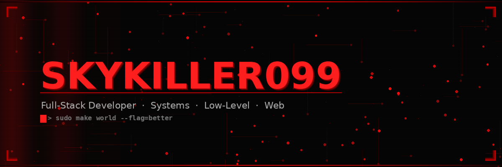

<!-- ╔══════════════════════════════════════════════════════════════╗ -->
<!-- ║           SKYKILLER099 — GITHUB PROFILE README              ║ -->
<!-- ║       Upload banner.png to your repo alongside this file    ║ -->
<!-- ╚══════════════════════════════════════════════════════════════╝ -->

<div align="center">

<!-- ════════════════ CUSTOM BANNER ════════════════ -->
<!-- Upload banner.png to this repo, then this will display it -->


<!-- ════════════════ ANIMATED TYPING ════════════════ -->
<br/>

[](https://git.io/typing-svg)

</div>

<br/>

<!-- ════════════════ RED DIVIDER ════════════════ -->


<br/>

<!-- ════════════════ BIO + STATS (2 col layout) ════════════════ -->
<table width="100%" border="0">
<tr>
<td width="52%" valign="top">


```
┌─────────────────────────────────────────┐
│                                         │
│   ▸ ALIAS      Skykiller099             │
│   ▸ ROLE       Full-Stack Developer     │
│   ▸ FOCUS      Systems · Web · Bots     │
│   ▸ LANGS      C  C++  JS  PY  SQL      │
│   ▸ OS         Linux / Windows          │
│   ▸ TIER       ▓▓▓▓▓▓▓▓▓▓  ELITE       │
│   ▸ STATUS     ● ONLINE  /  BUILDING    │
│                                         │
│   "Write code that outlives you."       │
│                                         │
└─────────────────────────────────────────┘
```

<br/>


```python
# skykiller099.py
class Developer:
    def __init__(self):
        self.name    = "Skykiller099"
        self.stack   = ["C","C++","JS","Python","Node"]
        self.coffee  = float("inf")
        self.fear    = None

    def run(self):
        while True:
            self.build()
            self.learn()
            self.ship()

Developer().run()
```

</td>
<td width="48%" valign="top" align="center">


<br/>


<br/>


</td>
</tr>
</table>

<br/>

<!-- ════════════════ ANIMATED DIVIDER ════════════════ -->


<br/>

<!-- ════════════════ TECH STACK ════════════════ -->
<div align="center">


<br/><br/>

<!-- LANGUAGES -->


<br/><br/>


<br/><br/>

<!-- TOOLS -->


<br/><br/>


<br/><br/>

<!-- DATABASES -->


<br/><br/>


<br/><br/>

<!-- ENVIRONMENTS -->


<br/><br/>


<br/><br/>

<!-- DEV TOOLS -->


<br/><br/>


</div>

<br/>

<!-- ════════════════ ANIMATED DIVIDER ════════════════ -->


<br/>

<!-- ════════════════ CONTRIBUTIONS + ACTIVITY ════════════════ -->
<div align="center">


</div>

<br/>


<br/>

<!-- SNAKE ANIMATION -->
<div align="center">


</div>

<br/>

<div align="center">
<picture>
  <source media="(prefers-color-scheme: dark)" srcset="https://raw.githubusercontent.com/skykiller099/skykiller099/output/github-contribution-grid-snake-dark.svg"/>
  <source media="(prefers-color-scheme: light)" srcset="https://raw.githubusercontent.com/skykiller099/skykiller099/output/github-contribution-grid-snake.svg"/>
  
</picture>
</div>

<br/>

<!-- ════════════════ ANIMATED DIVIDER ════════════════ -->


<br/>

<!-- ════════════════ TROPHIES ════════════════ -->
<div align="center">


<br/><br/>


</div>

<br/>

<!-- ════════════════ ANIMATED DIVIDER ════════════════ -->


<br/>

<!-- ════════════════ SKILLS TABLE ════════════════ -->
<div align="center">


<br/><br/>

| DOMAIN | TECHNOLOGIES | MASTERY |
|:------:|:------------:|:-------:|
| **Low-Level / Systems** | `C` `C++` | `▓▓▓▓▓▓▓▓░░` Advanced |
| **Web Front-End** | `HTML5` `CSS3` `JavaScript` | `▓▓▓▓▓▓▓▓▓░` Expert |
| **Back-End / API** | `Node.js` `Python` `Express` | `▓▓▓▓▓▓▓▓░░` Advanced |
| **Database** | `SQL` `MongoDB` `phpMyAdmin` | `▓▓▓▓▓▓▓░░░` Proficient |
| **Infrastructure** | `Linux` `Apache` `Pterodactyl` | `▓▓▓▓▓▓▓▓░░` Advanced |
| **Automation** | `Discord.js` `Electron` `Axios` | `▓▓▓▓▓▓▓▓▓░` Expert |
| **Environments** | `Debian` `Ubuntu` `Kali` `RPi` | `▓▓▓▓▓▓▓▓░░` Advanced |

</div>

<br/>

<!-- ════════════════ ANIMATED DIVIDER ════════════════ -->


<br/>

<!-- ════════════════ CONNECT ════════════════ -->
<div align="center">


<br/><br/>

[](https://github.com/skykiller099)
&nbsp;
[](https://github.com/skykiller099)
&nbsp;
[](https://github.com/skykiller099?tab=followers)

<br/><br/>

```
╔══════════════════════════════════════════════════════════════════╗
║                                                                  ║
║   Open to collabs · Open to chaos · Let's ship something real   ║
║                                                                  ║
║   skykiller099@github:~$ git commit -m "change the world"       ║
║                                                                  ║
╚══════════════════════════════════════════════════════════════════╝
```

<br/>

<!-- WAVE FOOTER -->


<sub>
  <code>Crafted with 🔴 by <b>Skykiller099</b></code>
  &nbsp;·&nbsp;
  <code>fork it · star it · fear it</code>
</sub>

</div>

---

<!--
════════════════════════════════════════════════
  SETUP INSTRUCTIONS
════════════════════════════════════════════════

1. Create a repo named exactly: skykiller099
   (same as your GitHub username)

2. Upload both files:
   - README.md  (this file)
   - banner.png (the custom banner image)

3. For the SNAKE animation, add this GitHub Action:
   Create file: .github/workflows/snake.yml

   ─────────────────────────────────────────────
   name: Generate Snake Animation

   on:
     schedule:
       - cron: "0 */12 * * *"
     workflow_dispatch:

   jobs:
     generate:
       runs-on: ubuntu-latest
       steps:
         - uses: Platane/snk@v3
           with:
             github_user_token: ${{ secrets.GITHUB_TOKEN }}
             outputs: |
               dist/github-contribution-grid-snake.svg
               dist/github-contribution-grid-snake-dark.svg?palette=github-dark
         - uses: crazy-max/ghaction-github-pages@v3
           with:
             target_branch: output
             build_dir: dist
           env:
             GITHUB_TOKEN: ${{ secrets.GITHUB_TOKEN }}
   ─────────────────────────────────────────────

4. That's it. Your profile is divine. 🔴

════════════════════════════════════════════════
-->
